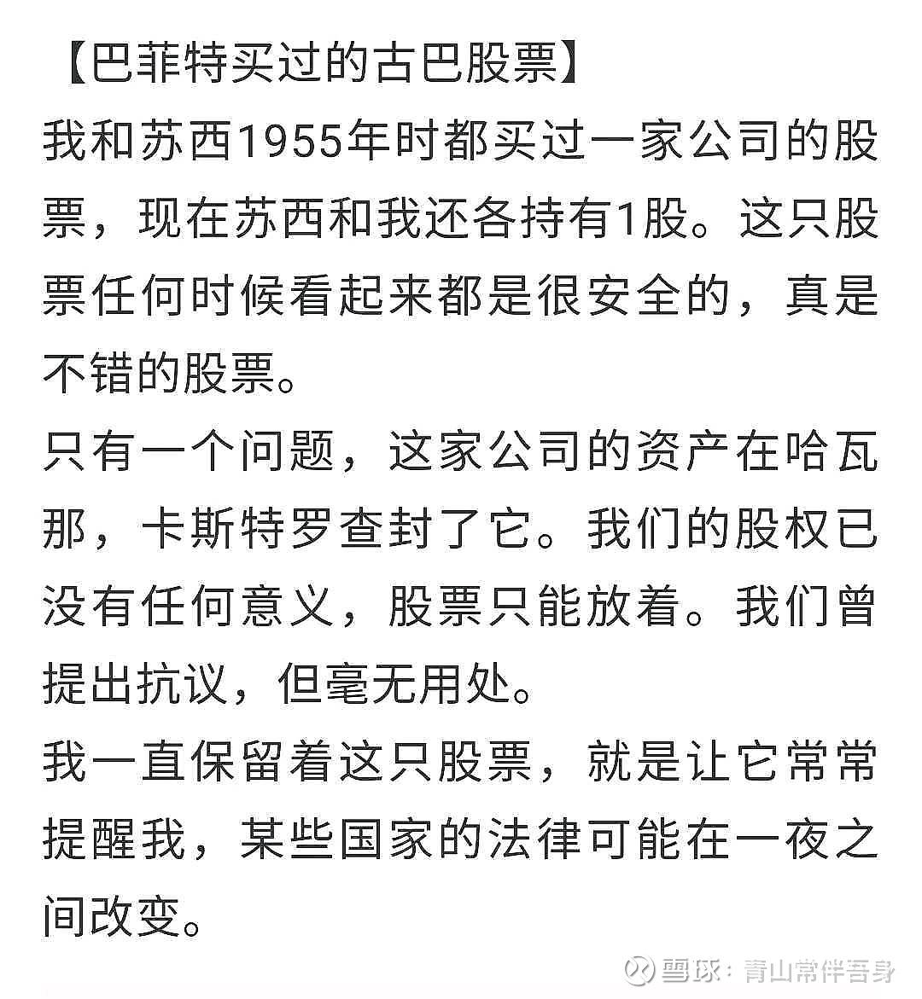

老巴留下了古巴的股票，来警戒自己有些地方的法律可能会随时变化

> 💡\
> 整天把核心科技跟创新挂在嘴上的宣传，有那么点骗子的意思了。核心科技创新跟用户需求有半毛钱关系吗？

只有那些想骗补贴，想把股票卖个好价钱而没有什么能力创造利润的企业，才会把技术创新挂在嘴上，不过您放心，他们也只是挂在嘴上，不会真干的，所以也不存在扭曲

不要总是做无罪辩护。这句话不是我说的，是著名刑法学家张明楷说的，原话说的是“律师不要总是做无罪辩护”，“一个案件经过公检法部门，经过了法院，如果是无罪的，它怎么能进行的下去呢，公检法的人不可能都是不懂法的人，对不对?所以不要做无罪辩护。”我在以前的文章中提到过，律师做无罪辩护仅仅是一份工作，而当事人则是人生，律师100个无罪辩护成功1个，那就叫成功，所以作为当事人，自己心里还是要有数的。

所以在学校里学习成绩不能太糟糕，人家一看成绩这么糟糕，第一印象就是这个人一定没有纪律性。
如果你的成绩还可以，又有一个特长，比方说围棋下得特别好，乒乓球打得特别好，那么人家就会觉得这个人还是有毅力的，虽然成绩中等，但还是有两下子的。如果你是一个肯学习又会学习的人，那么三五年之后就厉害了
那一个小的民营企业，那一年招了50个研究生，100个本科生，一个小企业哪能容得下那么多人。我在那几待了几个月就跑了，我觉得这是我不应该继续做的事情了，我需要做出改变。我不知道接下来能不能找到自己喜欢做的事情，但我一定要先走，所以我就到了小霸王。
那时候大家天天见面，天天一起打游戏。有个同事从澳门买了一台任天堂的游戏机借给我们玩了几天。

我对任天堂游戏是有感情的，我一玩游戏状态就好，所以我真正起家是从游戏开始的。有意思的是,这家公司大家都想离开(指星河)，我走了两年以后，小霸王都全国闻名了，然后我回去过一趟，发现当年说要走的人并没真的走。
我说你们这些人脑子坏了吗，两年前都说要走了怎么到现在还没走？他们说没有找到合适的地方。
所以错的事情要尽快停止，停止了不管要付出多大的代价都是最小的代价。
一发现这是不对的事情，你就要马上停手。我觉得很多人做不到这点。大多数人做不到，但是做到的人往往就会做得不错

我跟不少和尚交流过。他们对世界的看法，跟不是和尚的人并没有什么不同。他们的情绪，也并不一定就比不是和尚的人更加平和宁静。

> 💡\
> 和尚就是个职业，庙宇就是个职业场所。如果没有“商业”，这世界上就不会有庙宇，在哪不能“修行”，山上挖个洞不行吗

和主体用户多接触，多聊天，请他们吃饭，听他们吐槽，不要设计一些误导性的傻逼问卷自以为能得到真实反馈，要听他们吹牛，听他们骂街，用同理心去听，去发现问题和机会。

苹果在过去10年里每一年的股票都是减少的。腾讯除了2023年比2022年股数略有减少外，其他年都是增加的，而且2023年的股数居然比2016年还多。这种回购实际上就是在给员工发奖金哈。

> 回购就是注销！你没看懂！

哪个公司都可能有不合适的人，淘汰需要时间和事件
