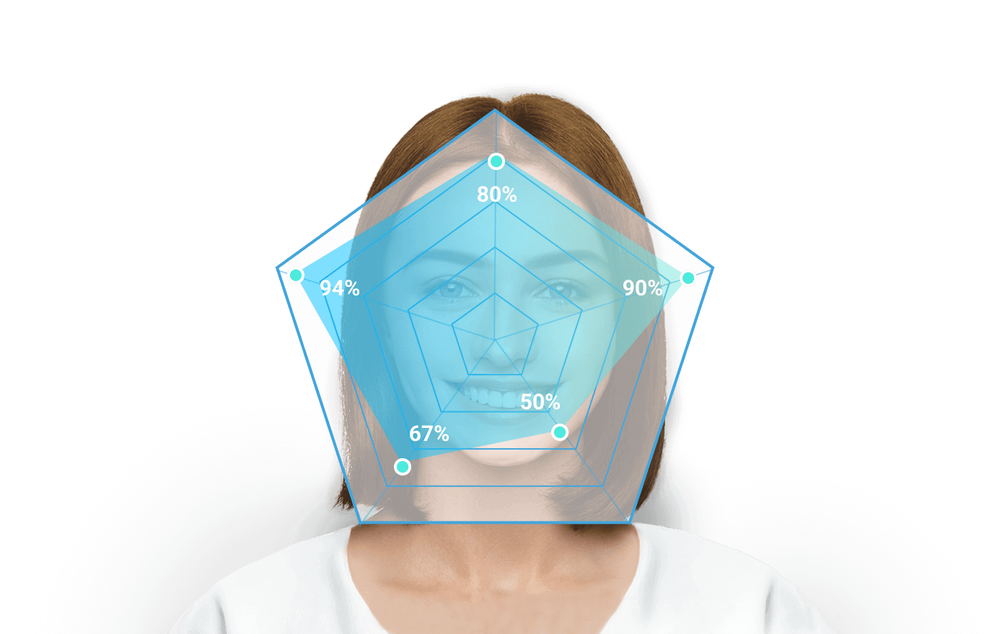

## 背景信息

**提示词**

*   悬疑剧我看不下去，一个片看10分钟如果还是不想看就弃了。

*   从来不追剧，一般都是看完结的剧。

*   听很多人的相声，杂乱无章，即听牛群、冯巩、姜昆。也听侯宝林、马三立、刘宝瑞，曹云金也听一点，但就一点点。不关注演员之间的口角，不理解这些口角，觉得只听一个人范围太狭窄了。

*   如果发现这个人的东西不爱听了，很容易放弃，比如郭德纲，05-06基本上很爱听，但后续听了几次都没听下去，就再也没有去听了。

**输出内容： 分析下这人的性格特点，智力，领导力，人际交往的能力等。**

## 智力

从提供的信息来看，虽然直接关于智力的数据有限，但可以从他的行为和兴趣中推测一些相关的智力特征：

*   **分析和评估能力**：这个人在决定是否继续观看某个节目时显示出快速的分析和评估能力。他能够在短时间内判断内容是否符合自己的口味，这需要较强的批判性思维能力。

*   **选择和决策能力**：他在面对多样化的娱乐选择时表现出明确的偏好和快速的决策能力。这表明他在处理信息和做出选择时具备高效的思维过程。

*   **自我调节能力**：能够在不再喜欢某位艺术家的作品时，及时调整自己的兴趣和活动，显示出良好的自我调节和适应能力。

这些行为特征暗示他在理解、处理信息和做决策方面具有相当的智力水平。当然，智力是一个广泛的概念，包括逻辑思维、问题解决、记忆、创造力等多方面的能力，单从这些描述中完全判断一个人的智力层面是有限的。

## 领导力

根据提供的信息，关于这个人的领导力可以从他的行为和选择中间接推断一些特征：

*   **决策能力**：这个人在选择观看什么节目或听哪位艺术家的表演时显示出快速和果断的决策能力。在领导中，能够迅速做出决定是一个重要的素质。

*   **独立性**：他似乎更喜欢独立地做出选择，而不是跟随流行或他人的意见。这种独立思考的能力是有效领导的关键组成部分，因为它能够帮助领导者在复杂或压力环境下保持清晰的判断。

*   **适应性和灵活性**：他能够根据自己的感受和喜好调整兴趣点，显示出在变化的环境中适应和调整的能力。在领导中，对变化的适应能力非常重要，它帮助领导者在不断变化的情况下调整策略和方法。

*   **不受干扰的专注**：这个人似乎能够过滤掉不相关的干扰（如演员之间的口角），专注于他认为重要的内容。在领导角色中，能够保持专注并不被边缘问题分散注意力是成功的关键。

虽然这些特点显示了一些潜在的领导能力，但仅凭娱乐选择和兴趣的变化来全面评估一个人的领导力还是不足够的。领导力还涉及人际交往、团队管理、战略规划等多个方面，需要更多的信息来综合评估。

## 人际交往能力：

*   **不关注人际冲突**：他对演员之间的争执不感兴趣，这可能反映出在人际交往中，他更倾向于避免冲突，不愿意深入参与可能引起分歧的讨论。

*   **适应性和变化的接受度**：他能够根据个人喜好调整关注的焦点，这表明他在社交中能较好地适应不同的人和环境。

这些特征暗示这个人在社交中没有明显的障碍，但他的独立性和对冲突的避免可能会在一些需要积极互动和深入交流的情况下限制他的社交深度。为了提高社交效果，可以考虑以下决策点：

*   **提高开放性**：尝试更加开放地参与社交活动，特别是那些可能需要更多人际互动和团队合作的场合。

*   **积极参与**：在避免不必要的冲突的同时，也可以适当地表达自己的意见和想法，通过积极参与增加与他人的互动和联系。

*   **增加同理心**：在避免冲突的同时，也需要关注他人的情感和需求，通过表现出同理心来建立更深层次的人际关系。

这些决策点可以帮助这个人在保持个性的同时，提高与人交往的质量和深度。
