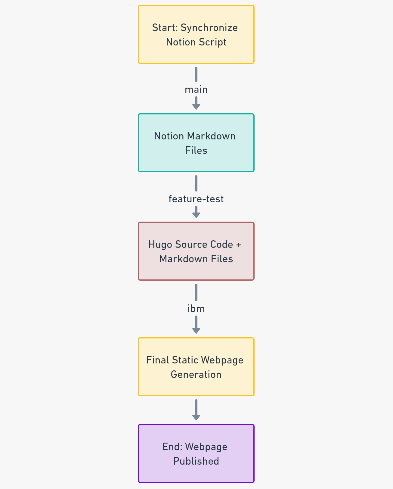
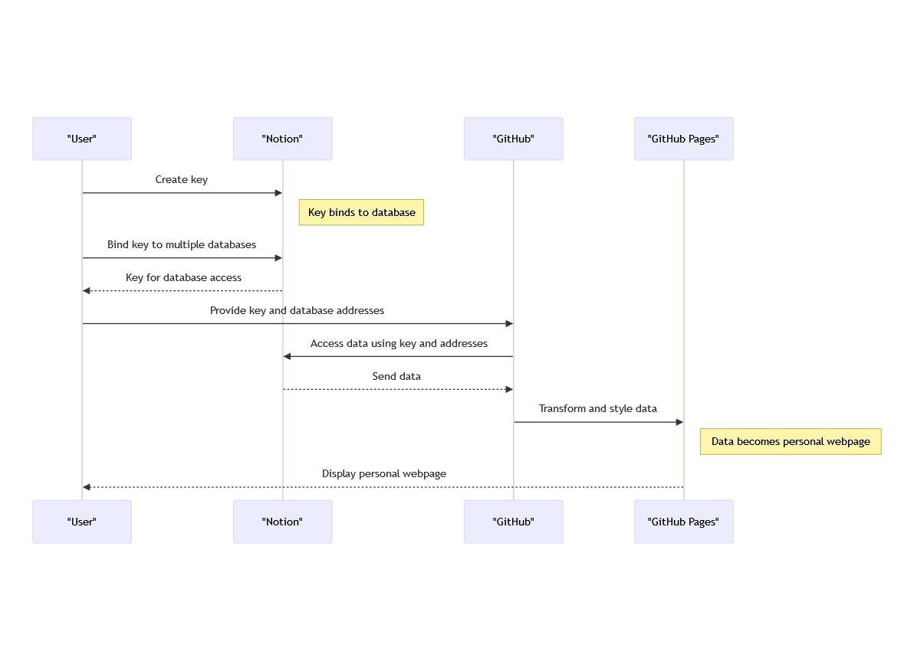
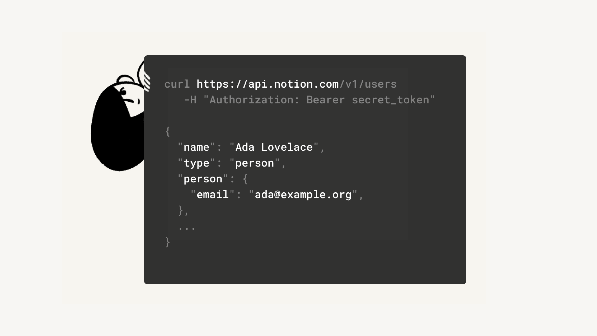

## 步骤很简单

*   同步 Notion 到 GitHub 使用 GitHub Actions：

    *   修改 GitHub Action 配置，以适配 Hugo 主题，借助 GPT 进行修改非常容易。

*   对同步过来的 Markdown 文件进行定制修改，主要根据所使用的 Hugo 主题来进行操作。

    *   注意：自定义的 GitHub Action 已经完成了这部分工作，不需要额外操作。

*   完成修改后，拉取 Hugo 博客源文件，并将 Markdown 文件复制并替换到相应位置。

*   进行编译和部署操作。

*   完成以上步骤后，可以访问已同步的博客内容。

## 项目作用

为了创建一个定制的 GitHub Action 以适应 Hugo 博客系统，我们可以遵循以下步骤来修改现有的 Notion 转 Markdown 的代码。这个过程涉及到对元数据、图片路径和中文字符的处理，以确保兼容性和渲染效果。

*   **修改封面图的处理**：

    *   当前的 Action 将 Notion 的封面图作为 `cover` 字段处理。在 Hugo 中，我们需要将此字段修改为 `image`。

    *   此外，需要去除封面图的路径信息，因为 Hugo 在某些配置下可能无法正确渲染带路径的图片。

*   **修改 Markdown 文件中的图片路径**：

    *   对于 Markdown 文件中的图片，也需要移除路径信息。这是为了确保 Hugo 能正确找到并渲染这些图片。

*   **处理路径中的中文字符**：

    *   如果路径信息中包含中文字符，可能会导致乱码问题。因此，需要将这些路径信息转换为英文，并使用下划线连接。

*   **AST（抽象语法树）解析**：

    *   由于 Notion 文件包含 YAML（用于元数据）和 Markdown（用于正文）两部分，需要使用不同的 AST 解析器来处理这两种格式。

*   **最终的 GitHub Action 功能**：

    *   能够抓取 Notion 文件并将其转换为适配 Hugo Stack 主题的 Markdown 文件。

    *   同时抓取 Notion 中的图片，并在本地保存。这些图片由 GitHub 进行渲染，大大节省了处理时间和资源。

*   **潜在的改进**：

    *   目前，这个 Action 不支持处理嵌入的第三方内容（如 YouTube 视频）。今后有可能进行改进以增加此功能。

通过这些修改，该 GitHub Action 能够有效地将 Notion 内容转换为 Hugo 可用的格式，同时优化图片处理和路径问题，以适应 Hugo 的渲染机制。这不仅提高了博客的管理效率，而且保证了内容的兼容性和可视化效果。

## 仓库对应的每个步骤

*   main   同步notion脚本

*   ibm              hugo源码文件 + md文件

*   notion          最终生成发布的静态网页



## 步骤描述图



noiton需要提供的有两个值：

1.  访问地址
2.  访问这个地址的key

关键词：

> [ **Notion API integrations – Notion Help Center**](https://www.notion.so/help/create-integrations-with-the-notion-api)\
> With Notion's API, you'll be able to create custom internal integrations. Some of our partners may also require an internal integration token in order to link their platform to your Notion workspace - below, we'll walk you through how to set this up 🏗️\
> <https://www.notion.so/help/create-integrations-with-the-notion-api>

中间用到了2个流水线。
mian.yml 和 deploy.yml

分别做详细介绍：

main.yml

```yaml
# This is a basic workflow to help you get started with Actions

name: NotionJAM

# Controls when the workflow will run
on:
  schedule:
    - cron: "0 21 * * *" # daily
  push:
    branches: [master, main]

  # Allows you to run this workflow manually from the Actions tab
  workflow_dispatch:

# A workflow run is made up of one or more jobs that can run sequentially or in parallel
jobs:
  # This workflow contains a single job called "build"
  build:
    # The type of runner that the job will run on
    runs-on: ubuntu-latest
    permissions:
      # Give the default GITHUB_TOKEN write permission to commit and push the
      # added or changed files to the repository.
      contents: write

    # Steps represent a sequence of tasks that will be executed as part of the job
    steps:
      # Checks-out your repository under $GITHUB_WORKSPACE, so your job can access it
      - uses: actions/checkout@v3

      - name: notion-jam
        uses: victornpb/notion-jam@v0.0.10
        with:
          NOTION_SECRET: ${{ secrets.NOTION_SECRET }}
          NOTION_DATABASE: https://www.notion.so/a2a70d82655a42b382921fb3d644acb0
          FILTER_PROP: Status
          FILTER_VALUES: Published
          CONVERT_PROP_CASE: snake
          ARTICLE_PATH: content/posts/{title}/README.md
          ASSETS_PATH: ./
          PARALLEL_PAGES: 25
          PARALLEL_DOWNLOADS_PER_PAGE: 3
          DOWNLOAD_IMAGE_TIMEOUT: 30
          SKIP_DOWNLOADED_IMAGES: true
          DOWNLOAD_FRONTMATTER_IMAGES: true
      - name: List files in the repository
        run: |
          echo "Listing all files and directories:"
          ls -R
      - name: Update Markdown files
        run: |
          # Find all markdown files and process them
          for file in $(find . -name '*.md'); do
            # Check if the file is README.md
             if [ "$(basename "$file")" = "README.md" ]; then
          # Rename README.md to index.md
            mv "$file" "$(dirname "$file")/index.md"
           # Update file variable to new path
            file="$(dirname "$file")/index.md"
           fi

              # Check if file exists before proceeding
              if [ -f "$file" ]; then
             # Extract the thumbnail filename
             thumbnail=$(grep '_thumbnail:' "$file" | sed 's/_thumbnail: .\///')

           # Add the image field with the extracted thumbnail filename
              sed -i "/_thumbnail: .*/a image: ${thumbnail}" "$file"

              sed -i '/slug: saul/d' "$file"
             # Remove the dot and backslash before the image path in markdown files
             sed -i 's/!\[\](\.\//!\[\](/g' "$file"

              sed -i '/type: gallery/d' "$file"

                if [ -f "./README.md" ]; then
                  rm "./README.md"
                fi
            else
           echo "File not found: $file"
            fi
          done
      
      - name: Save changes
        uses: stefanzweifel/git-auto-commit-action@v4
        with:
          commit_message: Commit changes
          branch: feature-test
          push_options: '--force'
          create_branch: true
          
      - name: Checkout vip repository
        uses: actions/checkout@v2
        with:
          repository: s110b/vip
          ref: master
          path: app
          ssh-key: ${{ secrets.MY_SSH_PRIVATE_KEY }}
  
      - name: Checkout current repository (feature-test)
        uses: actions/checkout@v2
        with:
          ref: feature-test
          path: content
  
      - name: Copy content to app/content/post/notion and show directory structure before
        run: |
          echo "Directory structure before changes:"
          tree app/ || sudo apt-get install tree && tree app/
          rm -rf app/content/post/*
          mkdir -p app/content/post/notion
         
          cp -r content/content/posts/* app/content/post/notion/
          echo "Directory structure after changes:"
          tree app/
  
      - name: Deploy 🚀
        uses: JamesIves/github-pages-deploy-action@v4
        with:
            repository-name: "s110b/notion"
            branch: ibm
            folder: app
            clean: true
            single-commit: true
            force: true
            ssh-key: ${{ secrets.MY_SSH_PRIVATE_KEY }}
```

## 上面流水线完成任务如下

> 转换notion为md文件

> shell修改md格式，去掉无用列，增加主页图片

> 下载hugo网站源文件，合并md文件到源文件

> 提交到ibm分支。

deploy.yml文件内容

```yaml
name: deploy

on:
  schedule:
    - cron: "0 21 * * *" # daily
  push:
    branches: [master, main]

jobs:
    build:
        runs-on: ubuntu-latest

        permissions:
            # Give the default GITHUB_TOKEN write permission to commit and push the
            # added or changed files to the repository.
            contents: write

        steps:
            - uses: actions/checkout@v3
              with:
                ref: ibm

            - name: Cache Hugo resources
              uses: actions/cache@v3
              env:
                  cache-name: cache-hugo-resources
              with:
                  path: resources
                  key: ${{ env.cache-name }}

            - uses: actions/setup-go@v4
              with:
                  go-version: "^1.17.0"
            - run: go version

            - name: Setup Hugo
              uses: peaceiris/actions-hugo@v2
              with:
                  hugo-version: "latest"
                  extended: true

            - name: Build
              run: hugo --minify --gc --baseURL "/notion/"

            - name: Deploy 🚀
              uses: JamesIves/github-pages-deploy-action@v4
              with:
                  repository-name: "s110b/notion"
                  branch: notion
                  folder: public
                  clean: true
                  single-commit: true
                  force: true
                  ssh-key: ${{ secrets.MY_SSH_PRIVATE_KEY }}  # Use the new token
```

## 编译源文件为静态网页

默认的github deploy到pages的不多做介绍。
